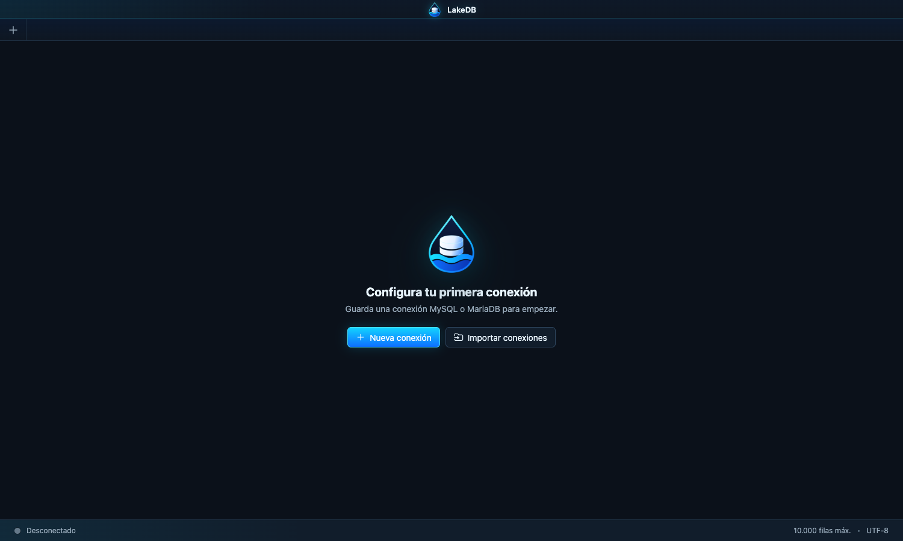

  

  <strong>Un cliente de escritorio moderno y tranquilo para MySQL y MariaDB.</strong> 
  Trabaja con todas tus conexiones, consultas y datos sin pelearte con la herramienta.

  
  
  

---

## Tu base de datos, sin ruido

LakeDB está pensado para quienes trabajan cada día con muchas conexiones MySQL y MariaDB. Cada servidor vive en su propio workspace, con su editor SQL, explorador, tablas y estado independiente.

  

## Lo que ya puedes hacer

| Área | Incluido en LakeDB Free |
| --- | --- |
| **Conexiones** | Conexiones ilimitadas, carpetas, colores por entorno, SSL, SSH Tunnel y reconexión automática. |
| **Editor SQL** | Monaco Editor, múltiples pestañas, ejecución por selección o sentencia, historial, favoritos y cancelación. |
| **Explorador** | Bases, tablas, vistas, procedimientos, funciones, triggers, eventos, índices, claves foráneas y DDL. |
| **Datos** | Grid virtualizada, paginación, filtros, ordenación, búsqueda y exportación CSV, JSON y Excel-compatible. |
| **Edición segura** | Insertar, editar, duplicar y eliminar con buffer de cambios, detección de conflictos y rollback. |
| **Protección** | Modo de solo lectura y confirmaciones reforzadas para operaciones peligrosas en producción. |
| **Importación** | Importa conexiones desde DBeaver, SQLyog, JSON, CSV y URLs MySQL/JDBC. |
| **Herramientas** | Backup y restore SQL, comparación de schemas y copia de estructura o datos entre conexiones. |

Todo se ejecuta en local. LakeDB no envía tus conexiones, consultas o credenciales a ningún servicio externo.

## LakeDB Free y LakeDB Pro

LakeDB será una única aplicación y una única descarga.

### LakeDB Free

La base gratuita para trabajar de verdad con MySQL y MariaDB:

- Sin límite artificial de conexiones.
- Sin límite de pestañas o edición.
- Sin cuenta obligatoria.
- Sin telemetría ni anuncios.

### LakeDB Pro · Próximamente

Cuando Pro esté disponible, podrás suscribirte desde la propia aplicación y desbloquear funciones avanzadas sin reinstalar nada:

- Lake AI para generar, explicar y revisar SQL.
- Agentes con contexto del esquema.
- Sincronización Cloud de workspaces, favoritos y configuración.
- Dashboards, KPIs y consultas programadas.
- Colaboración para equipos.

Free seguirá siendo la base gratuita de LakeDB. Pro añadirá capacidades avanzadas, no quitará las funciones esenciales que ya forman parte de Free.

## Descargar

1. Abre la página de [Releases](https://github.com/DavLagoHern/LakeDB/releases).
2. Descarga `LakeDB-mac-arm64.zip` de la versión más reciente.
3. Descomprime el archivo y mueve `LakeDB.app` a `Aplicaciones`.
4. Abre LakeDB.

> La primera beta está dirigida a macOS con Apple Silicon. La firma y notarización oficial están en preparación; mientras tanto, macOS puede pedir abrir la aplicación mediante clic derecho → **Abrir**.

## Ayuda y comunidad

- Consulta la [Wiki](https://github.com/DavLagoHern/LakeDB/wiki) para guías y preguntas frecuentes.
- Revisa las [incidencias conocidas](https://github.com/DavLagoHern/LakeDB/issues).
- Si encuentras un problema, abre un [nuevo issue](https://github.com/DavLagoHern/LakeDB/issues/new) indicando tu versión de LakeDB, macOS y servidor MySQL/MariaDB.
- Para propuestas, utiliza también Issues y explica el caso de uso que quieres resolver.

## Sobre este repositorio

Este es el repositorio público oficial de LakeDB. Aquí se publican:

- Binarios y notas de cada versión.
- Wiki, documentación y novedades.
- Incidencias, propuestas y roadmap público.

El código fuente de la aplicación se mantiene en un repositorio privado. Los binarios publicados aquí se generan automáticamente desde el repositorio de desarrollo después de superar las verificaciones de calidad.

---

   
  <strong>Modern database. Deeper insights.</strong>

