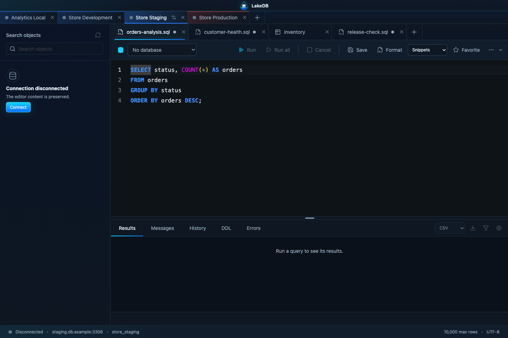
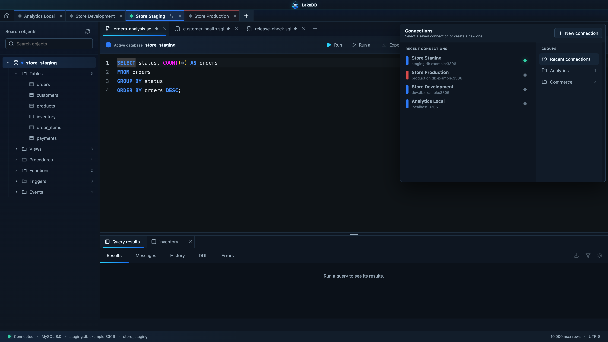
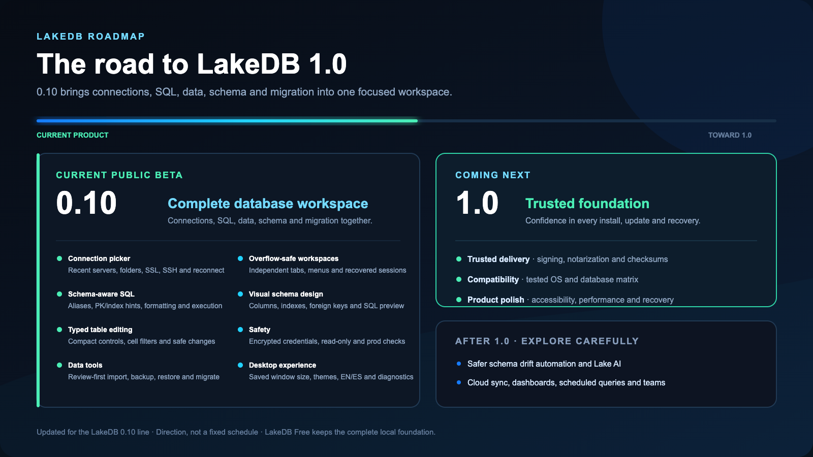

  

  <strong>A calm, modern desktop client for MySQL and MariaDB.</strong> 
  Manage every connection, query and dataset without fighting your tools.

  
  
  

  
  
  
  
  

---

## Your databases, without the noise

LakeDB is built for people who work with many MySQL and MariaDB connections every day. Every server gets its own workspace, SQL editor, object explorer, table views and independent state.

### Many servers, one calm workspace

Keep many database connections open at the same time and give each one as many SQL and table tabs as you need. Every connection preserves its own active tab, selected schema, editor content, table state and layout, so switching from local to staging or production never mixes your working context. Close LakeDB—or recover from an unexpected stop—and the complete multiconnection workspace comes back.

  

Four connection workspaces open at once; the active connection keeps its own SQL and table tabs.

### SQL that understands your schema

Complete databases, tables, aliases and columns from live metadata. LakeDB marks primary keys and indexes in suggestions, can insert multi-column index predicates after `WHERE`, formats compact or expanded SQL, and keeps query results or open tables visible below the editor.

### Inspect, edit and design

Browse large result sets in a virtualized grid, filter from the selected cell and edit rows with safe identity checks, conflict detection and rollback. Create or modify tables visually—columns, indexes, foreign keys and checks—while reviewing the generated SQL before applying it.

### Move data without losing control

Export complete reviewed queries to CSV, JSON, JSON Lines, Excel-compatible or SQL files with streaming, cancellation and optional GZIP. Back up and restore databases, compare schemas, plan migrations and review imported connections before LakeDB saves anything.

### Local by design

Connections, credentials, SQL and result data stay on your computer. Passwords use the local encrypted credential store; read-only connections, production confirmations, recovery snapshots and a sandboxed renderer protect daily work.

## What LakeDB 0.10 includes

LakeDB 0.10 is the current public beta line. It combines a split SQL workspace, schema-aware completion, typed table editing, compact controls and review-first connection imports.

| Area                   | Available today                                                                                                                                                                                                            |
| ---------------------- | -------------------------------------------------------------------------------------------------------------------------------------------------------------------------------------------------------------------------- |
| **Connections**        | Unlimited saved MySQL and MariaDB connections, folders, automatic group suggestions, environment colors, SSL, SSH tunnels, automatic reconnect and copyable diagnostics.                                                   |
| **Workspaces**         | Multiple open connections at once, each with independent SQL tabs above and query-result/table tabs in a smoothly resizable lower pane.                                                                                    |
| **SQL editor**         | Monaco Editor, schema-aware table/column completion, automatic aliases, PK/index hints, index predicate templates, compact/expanded formatting, execution, history, favorites and streaming exports up to 50 million rows. |
| **Object explorer**    | Lazy loading for every object type; click a table to open it below or double-click to insert its quoted name at the current SQL cursor.                                                                                    |
| **Table data**         | Virtualized grid, pagination, sorting, search, cell-driven filters and full-query export to CSV, JSON, JSON Lines, Excel-compatible `.xls` or SQL.                                                                         |
| **Safe editing**       | Type-aware date/time, numeric, boolean and enum editors plus buffered changes, validation, conflict detection, rollback and checked text/JSON/HTML editing.                                                                |
| **Backup and restore** | SQL database export, SQL restore with recovery backups, restore safeguards and production confirmation.                                                                                                                    |
| **Migration Studio**   | Source/target selectors, connection buttons, database comparison, selectable multi-table migration plans, structure/data copy and truncate-first workflows.                                                                |
| **Imports**            | Review and select DBeaver, SQLyog, JSON, CSV and MySQL/JDBC URL connections before saving; edit names/users, apply shared or individual passwords and resolve duplicates explicitly.                                       |
| **Safety**             | Read-only connections, reinforced production confirmations, renderer sandboxing and no direct renderer access to filesystem, SQLite, credentials or database sockets.                                                      |
| **Resilience**         | Home-first session restore, crash recovery, configuration backup/restore, update notices, local migrations with safety snapshots and diagnostics log.                                                                      |
| **Interface**          | Dark/light/system themes, density and font-size preferences, and English/Spanish UI ready for more languages.                                                                                                              |

Everything runs locally. LakeDB does not send your connections, queries or credentials to an external LakeDB service.

  
<strong>More screenshots</strong>

   
  

  

  

  

## Download

Open the [LakeDB 0.10.4 beta release](https://github.com/DavLagoHern/LakeDB/releases/tag/v0.10.4) and choose your platform:

| Platform            | Download                                                       | Install                                                      |
| ------------------- | -------------------------------------------------------------- | ------------------------------------------------------------ |
| macOS Apple Silicon | `LakeDB-*-mac-arm64.dmg` or `.zip`                             | Open the DMG or move `LakeDB.app` to Applications.           |
| Windows x64         | `LakeDB-*-win-x64-setup.exe`                                   | Run the installer. A portable `.exe` is also available.      |
| Linux x64           | `LakeDB-*-linux-x86_64.AppImage` or `LakeDB-*-linux-amd64.deb` | Make the AppImage executable, or install the Debian package. |

The `0.10.4` packages are intentionally unsigned while LakeDB is evaluated publicly, so your operating system may display a security warning. Only download LakeDB from this official repository. Every package includes a matching SHA-256 checksum. Stable 1.0+ releases are configured to require macOS/Windows signing and Apple notarization before publication.

## Version history

The latest build is **0.10.4**. The [version history](VERSION-HISTORY.md) records every published build with concise `ADD`, `CHANGE`, `FIX` and `SECURITY` entries. Full notes and installers remain attached to the downloadable releases retained on GitHub.

## The road to LakeDB 1.0

  

The [roadmap](ROADMAP.md) follows the product milestones from the first LakeDB foundation through the current 0.10 line, then shows the trust and compatibility work remaining for 1.0. Patch-level details stay in the version history.

## English and Spanish, ready for more

LakeDB is available in English and Spanish. Change the interface language under **Preferences → Language**; the application menu and workspace update with it. The translation layer is structured so more languages can be added without rewriting individual screens.

## Help shape LakeDB

- Read the [Wiki](https://github.com/DavLagoHern/LakeDB/wiki) for installation, workflows and troubleshooting.
- Propose and vote on features in [Ideas](https://github.com/DavLagoHern/LakeDB/discussions/categories/ideas).
- Ask for help in [Q&A](https://github.com/DavLagoHern/LakeDB/discussions/categories/q-a).
- Report reproducible bugs with the [bug report form](https://github.com/DavLagoHern/LakeDB/issues/new?template=bug-report.yml).
- Check the [community guide](COMMUNITY.md) before posting logs or screenshots.
- Review the [compatibility](COMPATIBILITY.md) and [support](SUPPORT.md) policies before reporting environment-specific behaviour.
- Read the [privacy](PRIVACY.md) and [security](SECURITY.md) policies before sharing diagnostics or reporting a vulnerability.

## About this repository

This is LakeDB's official public repository. It hosts binaries, release notes, documentation, issues and the public roadmap. The application source is maintained separately; published binaries are produced by the guarded release pipeline after the complete test suite passes.

---

   
  <strong>Modern database. Deeper insights.</strong>

