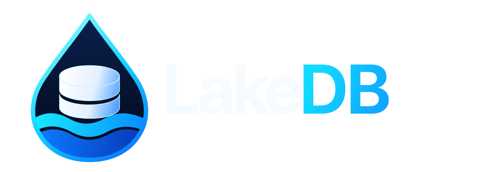
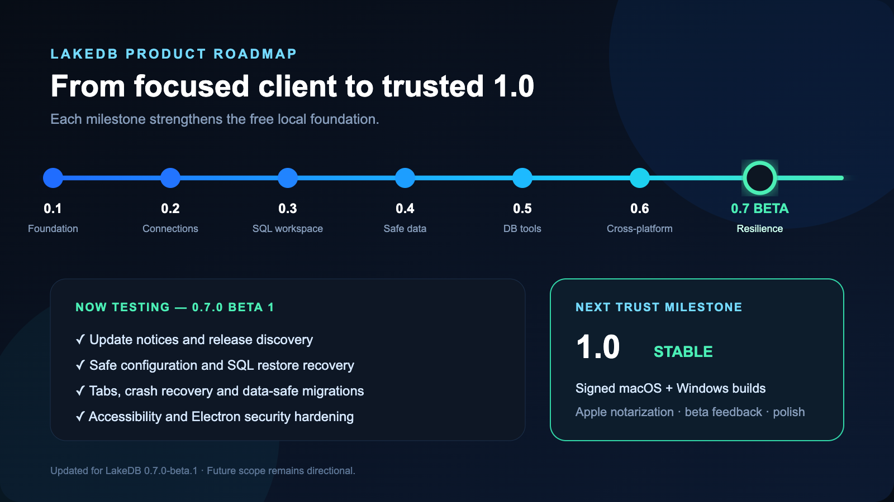
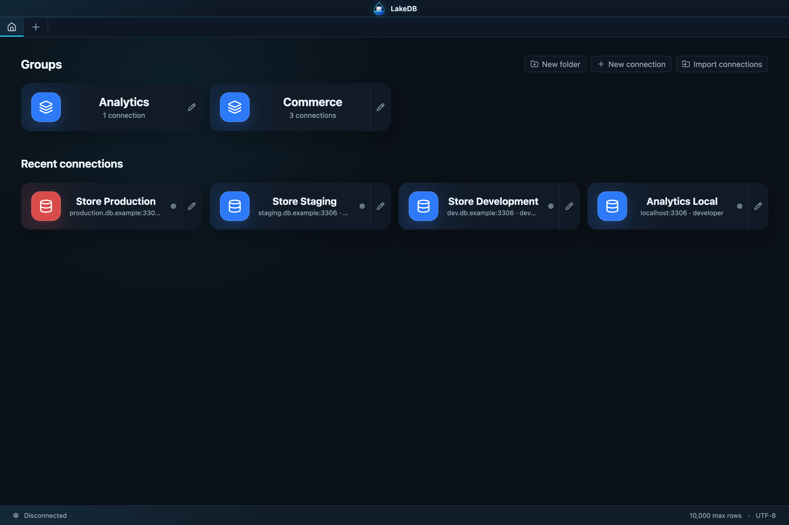
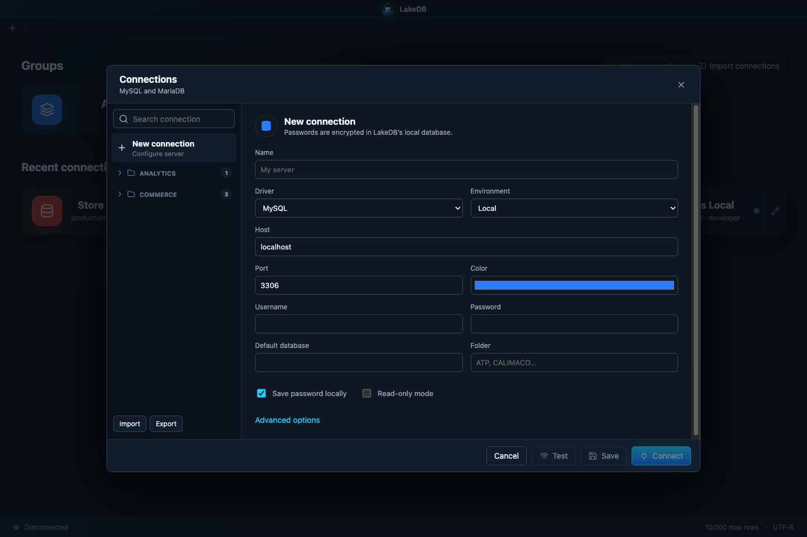
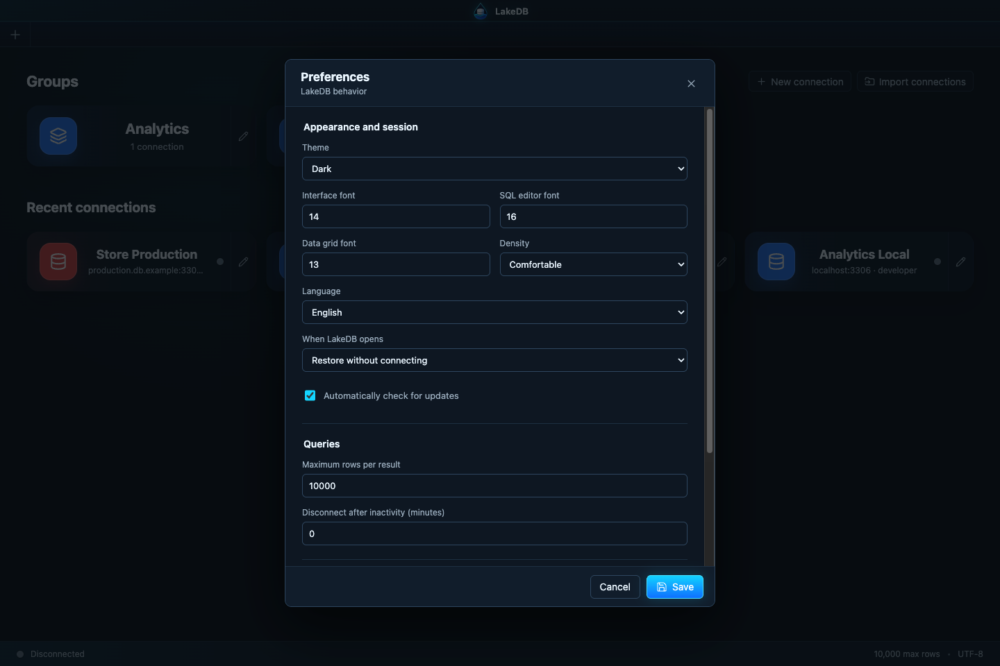
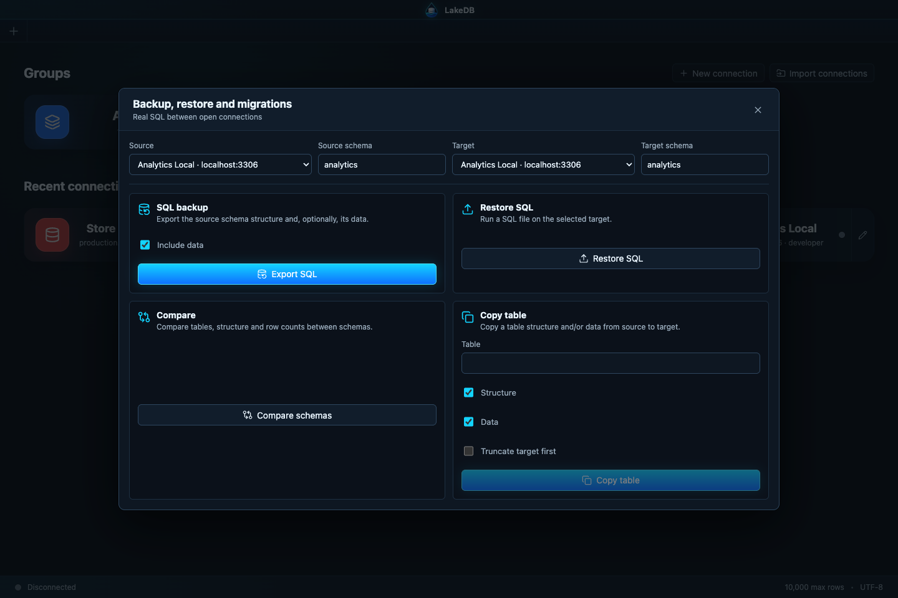
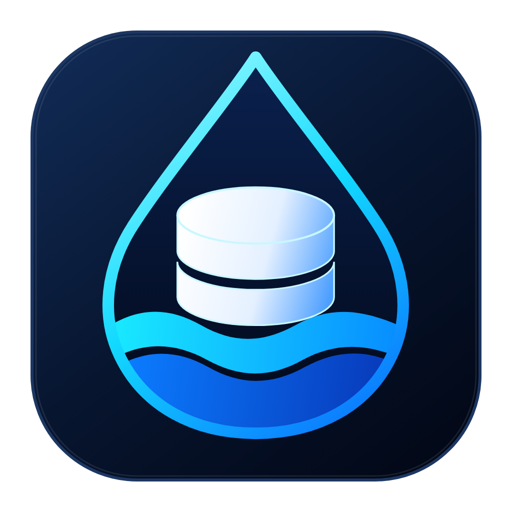

  

  <strong>A calm, modern desktop client for MySQL and MariaDB.</strong> 
  Manage every connection, query and dataset without fighting your tools.

  
  

  
  
  
  
  

---

## The road to LakeDB 1.0

  

LakeDB is growing in public milestones. See the [living roadmap](ROADMAP.md) for what each release added, the proposed path to 1.0 and the ideas being explored beyond it. The roadmap is updated with every release; future scope is directional and shaped by community feedback.

## Your databases, without the noise

LakeDB is built for people who work with many MySQL and MariaDB connections every day. Every server gets its own workspace, SQL editor, object explorer, table views and independent state.

### Multitab across every connection

Keep many database connections open at the same time and give each one as many SQL and table tabs as you need. Every connection preserves its own active tab, selected schema, editor content, table state and layout, so switching from local to staging or production never mixes your working context. Close LakeDB—or recover from an unexpected stop—and the complete multiconnection workspace comes back.

  

Group connections by client or environment and spot production at a glance.

## Everything you need for daily database work

| Area | Included in LakeDB Free |
| --- | --- |
| **Connections** | Unlimited connections, folders, environment colors, SSL, SSH tunnels and automatic reconnection. |
| **Multiconnection tabs** | Many connections open at once, each with independent SQL/table tabs, schemas and recoverable workspace state. |
| **SQL editor** | Monaco Editor, multiple tabs per connection, selection or statement execution, history, favorites and cancellation. |
| **Explorer** | Databases, tables, views, procedures, functions, triggers, events, indexes, foreign keys and DDL. |
| **Data** | Virtualized grid, pagination, filters, sorting, search and CSV, JSON or Excel-compatible export. |
| **Safe editing** | Insert, edit, duplicate and delete with a change buffer, conflict detection and rollback. |
| **Protection** | Read-only mode and reinforced confirmation for dangerous production operations. |
| **Import** | Import connections from DBeaver, SQLyog, JSON, CSV and MySQL/JDBC URLs. |
| **Tools** | SQL backup and restore, schema comparison, and table structure/data copy between connections. |
| **Resilience** | Update notices, safe configuration restore, crash recovery and protected local-data migrations. |

Everything runs locally. LakeDB does not send your connections, queries or credentials to an external LakeDB service.

  
<strong>More screenshots</strong>

   
  

  

  

## Download

Open the [latest release](https://github.com/DavLagoHern/LakeDB/releases/latest) and choose your platform:

| Platform | Download | Install |
| --- | --- | --- |
| macOS Apple Silicon | `LakeDB-*-mac-arm64.dmg` or `.zip` | Open the DMG or move `LakeDB.app` to Applications. |
| Windows x64 | `LakeDB-*-win-x64-setup.exe` | Run the installer. A portable `.exe` is also available. |
| Linux x64 | `LakeDB-*-linux-x86_64.AppImage` or `LakeDB-*-linux-amd64.deb` | Make the AppImage executable, or install the Debian package. |

The `0.7.0-beta.1` packages are intentionally unsigned while LakeDB is evaluated publicly, so your operating system may display a security warning. Only download LakeDB from this official repository. Every package includes a matching SHA-256 checksum. Stable releases are configured to require macOS/Windows signing and Apple notarization before publication.

## 0.7 public beta: built for recovery

The current beta adds update notices, safe configuration restore, preserved tabs after normal or unexpected exits, pre-migration snapshots and recovery backups before SQL restores. Read the [beta notes](https://github.com/DavLagoHern/LakeDB/releases/tag/v0.7.0-beta.1) and the [recovery guide](https://github.com/DavLagoHern/LakeDB/wiki/Updates-Recovery-and-Restores) before testing an upgrade with important local profiles.

## English and Spanish, ready for more

LakeDB is available in English and Spanish. Change the interface language under **Preferences → Language**; the application menu and workspace update with it. The translation layer is structured so more languages can be added without rewriting individual screens.

## LakeDB Free and Pro

LakeDB will remain one application and one download.

- **Free** is the complete local foundation: no artificial connection or tab limits, no mandatory account, no telemetry and no ads.
- **Pro** will be an optional subscription inside the same app, unlocking planned capabilities such as Lake AI, cloud sync, dashboards, scheduled queries and team collaboration.

Free will keep the essential database features it already provides. Read the [Free and Pro roadmap](https://github.com/DavLagoHern/LakeDB/wiki/LakeDB-Free-and-Pro) for more context.

## Help shape LakeDB

- Read the [Wiki](https://github.com/DavLagoHern/LakeDB/wiki) for installation, workflows and troubleshooting.
- Propose and vote on features in [Ideas](https://github.com/DavLagoHern/LakeDB/discussions/categories/ideas).
- Ask for help in [Q&A](https://github.com/DavLagoHern/LakeDB/discussions/categories/q-a).
- Report reproducible bugs with the [bug report form](https://github.com/DavLagoHern/LakeDB/issues/new?template=bug-report.yml).
- Check the [community guide](COMMUNITY.md) before posting logs or screenshots.

## About this repository

This is LakeDB's official public repository. It hosts binaries, release notes, documentation, issues and the public roadmap. The application source is maintained in a private repository; published binaries are generated automatically after the development repository passes its quality checks.

---

   
  <strong>Modern database. Deeper insights.</strong>

