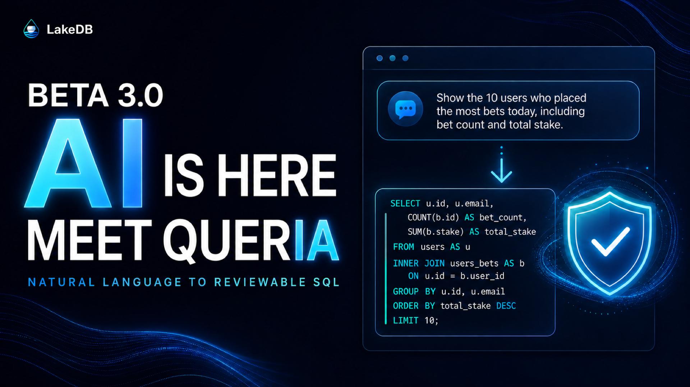
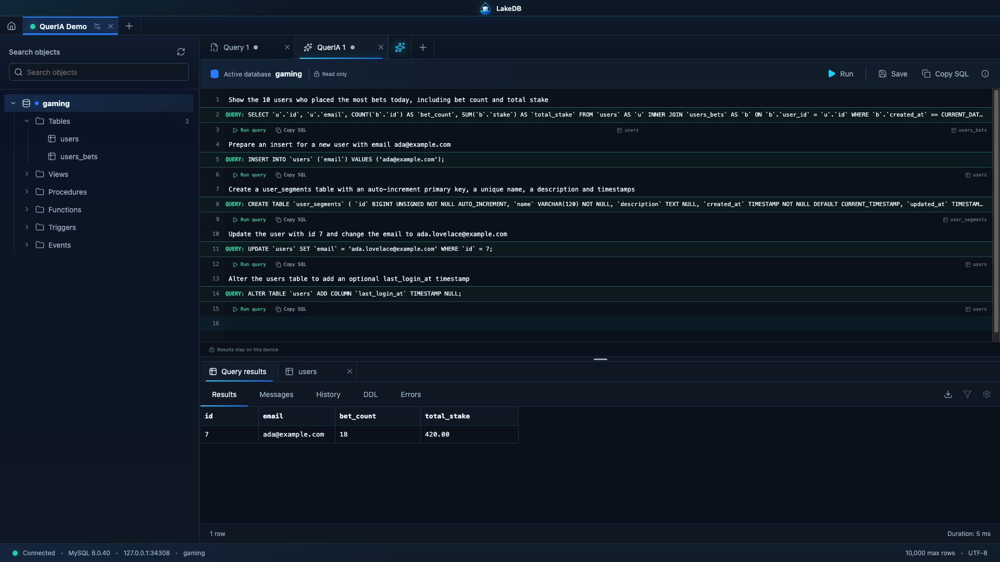
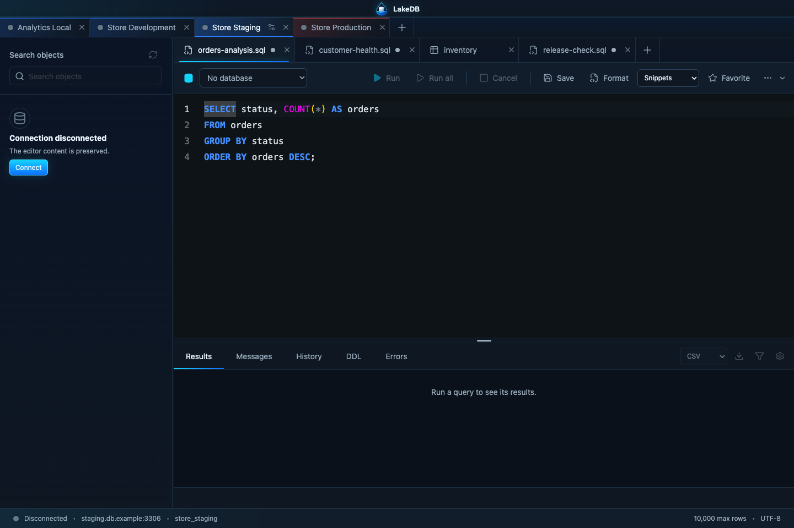
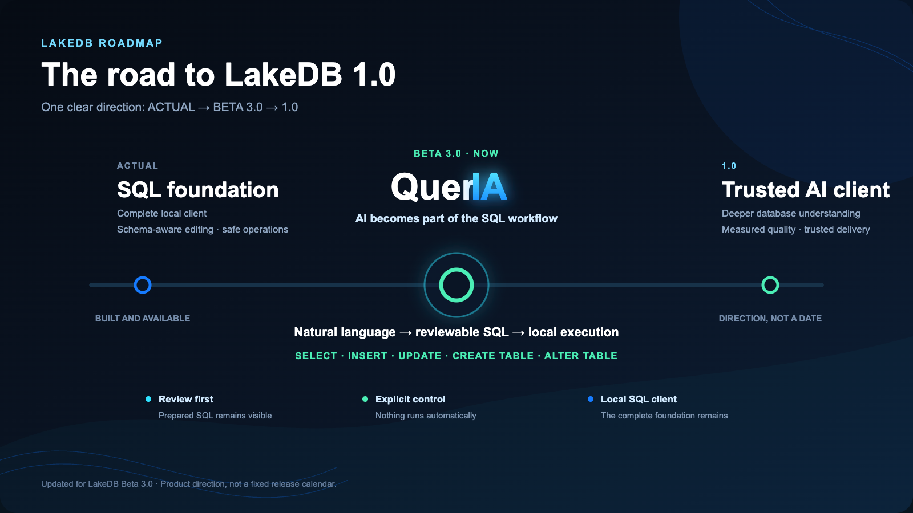
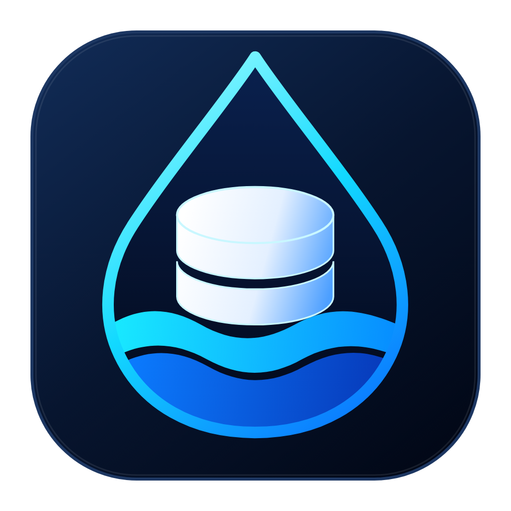

<p align="center">
  
</p>

<p align="center">
  <strong>A complete MySQL and MariaDB desktop client with reviewable AI.</strong><br>
  Ask in natural language, inspect the SQL, and run it through the same local workflow you trust.
</p>

<p align="center">
  <a href="https://davlagohern.github.io/LakeDB/"></a>
  <a href="https://github.com/DavLagoHern/LakeDB/releases/latest"></a>
  <a href="https://github.com/DavLagoHern/LakeDB/releases/latest"></a>
  <a href="https://www.patreon.com/LakeDB"></a>
</p>

<p align="center">
  
  
  
  
  
</p>

---

<p align="center">
  
</p>

<p align="center"><sub><strong>AI is the headline of Beta 3.0.</strong> Quer<span style="color:#19d2ff">IA</span> turns a natural-language request into SQL you can inspect before anything runs.</sub></p>

## Meet Quer<span style="color:#19d2ff">IA</span>

QuerIA brings natural language into the normal LakeDB query workflow. It is not
a separate chatbot: it is a line-based query document beside your SQL tabs.
Write several requests, prepare only the active line, review the complete SQL,
copy it or explicitly run it through the normal local results panel.

<p align="center">
  
</p>

<p align="center"><sub><strong>Five distinct workflows in a real Beta 3.0 session.</strong> One QuerIA document prepares SELECT, INSERT, UPDATE, CREATE TABLE and ALTER TABLE statements while the normal LakeDB results workspace stays in place.</sub></p>

### More than a simple SELECT

QuerIA Beta 3.0 can prepare one reviewable statement at a time:

- `SELECT`, `SHOW`, `DESCRIBE` and `EXPLAIN`;
- `INSERT`, `UPDATE`, `DELETE` and `REPLACE`;
- `CREATE`, `ALTER`, `DROP`, `TRUNCATE` and `RENAME`.

Examples:

```text
Show the 10 users who placed the most bets today,
including bet count and total stake.
```

```sql
SELECT
  `u`.`id`,
  `u`.`email`,
  COUNT(`b`.`id`) AS `bet_count`,
  SUM(`b`.`stake`) AS `total_stake`
FROM `users` AS `u`
INNER JOIN `users_bets` AS `b` ON `b`.`user_id` = `u`.`id`
WHERE `b`.`created_at` >= CURRENT_DATE()
  AND `b`.`created_at` < CURRENT_DATE() + INTERVAL 1 DAY
GROUP BY `u`.`id`, `u`.`email`
ORDER BY `total_stake` DESC
LIMIT 10;
```

```text
Prepare an insert for a new user with email ada@example.com.
```

```sql
INSERT INTO `users` (`email`) VALUES ('ada@example.com');
```

```text
Create a user_segments table with an auto-increment primary key,
a unique name, a description and timestamps.
```

```text
Update the user with id 7 and change the email to ada.lovelace@example.com.
```

```text
Alter the users table to add an optional last_login_at timestamp.
```

Prepared SQL is never executed automatically. LakeDB shows it first and uses
the normal connection, read-only rules, production safeguards, messages,
history and results only after explicit approval.

## Private until you opt in

QuerIA starts disabled. On first launch, LakeDB presents a privacy notice and
beta terms with two clear choices:

- **Activate and try QuerIA** enables the optional service.
- **Do not activate yet** makes no request to LakeDB Service.

You can review and activate it later from Preferences.

<p align="center">
  
</p>

<p align="center"><sub><strong>Explicit opt-in before any service connection.</strong> The notice explains the data boundary and keeps QuerIA disabled when the user chooses “Do not activate yet”.</sub></p>

When QuerIA is enabled and used:

- the question and minimum useful schema metadata are processed temporarily;
- database credentials, table rows and query results are never sent;
- questions, generated SQL, schema metadata and table names are not retained;
- only an anonymous identifier, optional email or alias, plan, aggregate usage,
  success or failure, token totals and latency are retained.

The complete boundary is documented in [PRIVACY.md](PRIVACY.md) and the
[QuerIA beta terms](TERMS.md). QuerIA includes a free beta allowance.
Additional plans may be introduced later.

## Still a complete SQL client

AI joins the existing LakeDB workflow; it does not replace it.

| Area | Available in Beta 3.0 |
| --- | --- |
| **Connections** | Multiple simultaneous MySQL and MariaDB connections, folders, environment colors, SSL, SSH tunnels, read-only mode and diagnostics. |
| **Workspaces** | Independent SQL, QuerIA and table tabs for every connection, with restored editor content, selected schema and layout. |
| **SQL editor** | Monaco Editor, proactive schema/table completion, aliases, columns, PK/index hints, snippets, formatting, Explain, transactions, history and streaming exports. |
| **QuerIA** | Multiple question lines and tabs, minimum-schema grounding, visible SQL review, copy and explicit local execution. |
| **Table data** | Virtualized grids, pagination, search, sorting, cell-driven filters and typed safe editing with conflict checks and rollback. |
| **Database tools** | Backup, restore, schema comparison, migration planning, connection imports and reviewable generated SQL. |
| **Safety** | Local encrypted credentials, production confirmations, renderer sandboxing, read-only enforcement and no remote database execution. |
| **Resilience** | Crash recovery, disconnected session restore, configuration backup, verified updates, local migrations and diagnostics. |

<p align="center">
  
</p>

<p align="center"><sub><strong>The complete SQL foundation remains available.</strong> Each connection owns its SQL tabs, table tabs, active schema and restored workspace state.</sub></p>

## QuerIA roadmap

| Stage | Direction |
| --- | --- |
| **Actual** | Complete local SQL foundation: independent workspaces, schema-aware editing, safe data tools, operations and recovery. |
| **Beta 3.0 — new** | Natural-language query documents, one grounded SELECT, DML or DDL statement, visible review and explicit local execution. |
| **1.0 — direction** | Ideas include deeper table, field, relationship, index and SQL-object understanding, measured quality, stable privacy, signed delivery and product polish. |

<p align="center">
  <a href="ROADMAP.md"></a>
</p>

<p align="center"><sub><strong>Actual → Beta 3.0 → 1.0.</strong> The roadmap shows the existing SQL client, the QuerIA product step and the trusted-client direction without inventing intermediate release promises.</sub></p>

Roadmap items describe direction, not a promise of a particular release date.
See the [complete roadmap](ROADMAP.md) for product and trust milestones.

## Download

Open the [latest LakeDB release](https://github.com/DavLagoHern/LakeDB/releases/latest)
and choose your platform:

| Platform | Download | Install |
| --- | --- | --- |
| macOS Apple Silicon | `LakeDB-*-mac-arm64.dmg` or `.zip` | Open the DMG or move `LakeDB.app` to Applications. |
| Windows x64 | `LakeDB-*-win-x64-setup.exe` | Run the installer. A portable `.exe` is also available. |
| Linux x64 | `LakeDB-*-linux-x86_64.AppImage` or `LakeDB-*-linux-amd64.deb` | Make the AppImage executable, or install the Debian package. |

LakeDB is still a public beta. macOS packages are ad-hoc signed but not yet
notarized; Windows packages do not yet have a trusted code-signing certificate.
Only download LakeDB from this repository and verify the published SHA-256.

## Help shape LakeDB

- Read the [Wiki](https://github.com/DavLagoHern/LakeDB/wiki).
- Report reproducible bugs with the [bug report form](https://github.com/DavLagoHern/LakeDB/issues/new?template=bug-report.yml).
- Propose and discuss ideas in [GitHub Discussions](https://github.com/DavLagoHern/LakeDB/discussions).
- Support signing, infrastructure and independent development on [Patreon](https://www.patreon.com/LakeDB).

Patreon support is optional and is not connected to QuerIA allowances in Beta
3.0. Testing, reporting and sharing LakeDB are equally useful.

## About this repository

This is LakeDB's official public repository. It hosts binaries, release notes,
documentation, issues and the public roadmap. Application source is maintained
separately; published binaries come from the guarded release pipeline after the
complete test suite passes.

---

<p align="center">
  <br>
  <strong>SQL when you want it. Natural language when you need it.</strong>
</p>
