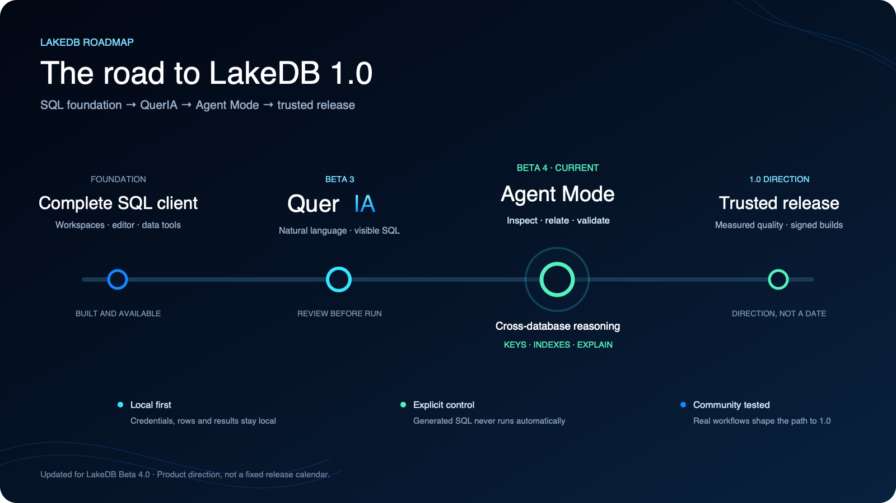

  

  <strong>A complete MySQL and MariaDB desktop client with reviewable AI.</strong> 
  Ask directly or let QuerIA investigate relationships and indexes before it prepares SQL.

  
  
  
  

  
  
  
  
  

---

  

<strong>New in Beta 4.0.</strong> QuerIA can investigate tables, relationships and indexes across databases before presenting reviewable SQL.

## Meet QuerIA

QuerIA is part of the normal LakeDB query workspace, not a separate chatbot.
Write a request, inspect the complete SQL and choose whether to copy it or run
it through your local connection.

Beta 4 adds two generation modes:

- **Normal** prepares direct questions quickly when the relevant tables are
  already clear.
- **Agentic** explores a broader catalog, inspects table structures, keys and
  indexes, relates sources across databases and reviews `SELECT` plans with
  `EXPLAIN`.

Both modes keep the same control boundary: generated SQL is visible and nothing
runs automatically.

### Agentic database understanding

Agentic generation is designed for questions where the complete answer is not
contained in the first table mentioned. It can:

- discover relevant tables across several accessible databases;
- inspect columns, primary keys, indexes and foreign keys;
- infer a relationship when metadata and shared identifiers support it;
- revise a draft that ignores a relevant source;
- validate the final `SELECT` plan and report its index and access signals;
- leave editable placeholders instead of blocking on missing literal values.

QuerIA shows the tables used beside the result. Selecting one opens that table
in the lower workspace without taking you away from the QuerIA document.
Explanations follow the application language.

### Reviewable SQL beyond SELECT

QuerIA can prepare one reviewable statement at a time:

- `SELECT`, `SHOW`, `DESCRIBE` and `EXPLAIN`;
- `INSERT`, `UPDATE`, `DELETE` and `REPLACE`;
- `CREATE`, `ALTER`, `DROP`, `TRUNCATE` and `RENAME`.

Prepared statements use the normal LakeDB connection, read-only rules,
production safeguards, history, messages and results only after explicit
approval.

## A complete SQL client

AI joins the existing LakeDB workflow; it does not replace it.

| Area | Available in Beta 4.1 |
| --- | --- |
| **Connections** | Multiple simultaneous connections, folders, colors, SSL, SSH tunnels, read-only mode, diagnostics and search from Home or the connection picker. |
| **Workspaces** | Independent SQL, QuerIA and table tabs per connection, with restored editor content, selected schema and layout. |
| **SQL editor** | Monaco Editor, proactive schema completion, aliases, columns, PK/index hints, safe automatic keyword casing, formatting, Explain, transactions, history and streaming exports. |
| **QuerIA** | Normal and Agentic generation, cross-database relationships, index inspection, `EXPLAIN` review, visible SQL and explicit local execution. |
| **Results and data** | Local query-result filters, draggable result columns, virtualized table grids, pagination, search, sorting and typed safe editing with conflict checks and rollback. |
| **Database tools** | Backup, restore, schema comparison, migration planning, connection imports and reviewable generated SQL. |
| **Safety** | Local encrypted credentials, production confirmations, renderer sandboxing, read-only enforcement and no remote database execution. |
| **Resilience** | Stable device identity, crash recovery, session restore, verified updates, configuration backup and diagnostics. |

  

<strong>The full SQL foundation remains local.</strong> Each connection owns its SQL tabs, table tabs, active schema and restored workspace state.

## Private until you opt in

QuerIA starts disabled. LakeDB makes no service request until you review the
privacy notice and beta terms and explicitly activate it.

  

When QuerIA is used:

- the question and minimum useful schema metadata are processed temporarily;
- database credentials, table rows and query results are never sent;
- questions, generated SQL, schema metadata and table names are not retained;
- only the account identity, optional profile, aggregate operational usage,
  success or failure and latency are retained.

Read the complete boundary in [PRIVACY.md](docs/PRIVACY.md) and
[TERMS.md](docs/TERMS.md). The complete SQL client remains available when QuerIA is
disabled or unavailable. QuerIA can be disabled again at any time; LakeDB stops
contacting the service and requires explicit consent before reactivation.

## Request Beta Tester

Beta 4 includes a FREE QuerIA allowance. People who want to test real
multi-database workflows can request Beta Tester access from
**Settings → Account**. The short use-case field helps evaluate what kind of
queries should be tested; it is not a login or an email-verification flow.

  

The most useful contributions are reproducible bugs, real relationship
examples and clear explanations of where QuerIA selected the wrong table,
join or index.

## Where LakeDB differs

Shared capabilities such as multiple connections, SSH/SSL, normal
autocomplete and editable grids are intentionally omitted.

**✓ Included · ◐ Limited, paid or a different workflow · × No comparable built-in workflow · — No built-in AI / not applicable**

| Focused capability | LakeDB | DBeaver | TablePlus | MySQL Workbench | HeidiSQL |
| --- | :---: | :---: | :---: | :---: | :---: |
| Restored independent connection workspaces | ✓ | ✓ | ✓ | ◐ | ◐ |
| PK and index-aware completion predicates | ✓ | ◐ | × | × | × |
| Typed staged edits with conflict checks and rollback | ✓ | ◐ | ◐ | ◐ | ◐ |
| Guided restore with automatic recovery dump | ✓ | ◐ | ◐ | ◐ | ◐ |
| Schema compare and generated migration plan | ✓ | ◐ | × | ✓ | × |
| Dedicated line-based natural-language documents | ✓ | × | × | — | — |
| Agentic cross-database relationship discovery | ✓ | ◐ | × | — | — |
| Mandatory local SQL review before execution | ✓ | ◐ | ◐ | — | — |
| AI never receives row data or query results | ✓ | ◐ | ✓ | — | — |
| No retained questions, generated SQL or schema names | ✓ | × | ◐ | — | — |

A partial mark includes paid editions, plug-ins or a materially different
workflow. Sources: [DBeaver documentation](https://dbeaver.com/docs/dbeaver/AI-command/),
[TablePlus documentation](https://docs.tableplus.com/llm-plugin),
[MySQL Workbench manual](https://dev.mysql.com/doc/workbench/en/) and
[HeidiSQL documentation](https://www.heidisql.com/).

## Road to 1.0

| Stage | Direction |
| --- | --- |
| **SQL foundation** | Independent workspaces, schema-aware editing, safe data operations, database tools and recovery. |
| **Beta 3** | Natural-language query documents, visible SQL and explicit local execution. |
| **Beta 4 — current** | Normal and Agentic generation, cross-database relationships, index inspection, reversible opt-in, local result filters and draggable result columns. |
| **1.0 direction** | Measured quality, trusted signing and distribution, compatibility validation and complete product polish. |

  

Roadmap items describe direction, not a fixed release date. See
[ROADMAP.md](docs/ROADMAP.md) for the complete quality and trust gates.

## Download

Open the [latest LakeDB release](https://github.com/DavLagoHern/LakeDB/releases/latest)
and choose your platform:

| Platform | Download | Install |
| --- | --- | --- |
| macOS Apple Silicon | `LakeDB-*-mac-arm64.dmg` or `.zip` | Open the DMG or move `LakeDB.app` to Applications. |
| Windows x64 | `LakeDB-*-win-x64-setup.exe` | Run the installer. A portable `.exe` is also available. |
| Linux x64 | `LakeDB-*-linux-x86_64.AppImage` or `LakeDB-*-linux-amd64.deb` | Make the AppImage executable, or install the Debian package. |

LakeDB is still a public beta. macOS packages are ad-hoc signed but not yet
notarized; Windows packages do not yet have a trusted code-signing certificate.
Only download LakeDB from this repository and verify the published SHA-256.

## Help shape LakeDB

- Read the [Wiki](https://github.com/DavLagoHern/LakeDB/wiki).
- Report reproducible bugs with the [bug report form](https://github.com/DavLagoHern/LakeDB/issues/new?template=bug-report.yml).
- Propose ideas in [GitHub Discussions](https://github.com/DavLagoHern/LakeDB/discussions).
- Follow development updates on [Patreon](https://www.patreon.com/LakeDB).

Testing, reporting and sharing LakeDB are the most useful ways to help this
beta.

---

   
  <strong>SQL when you want it. Natural language when you need it.</strong>

