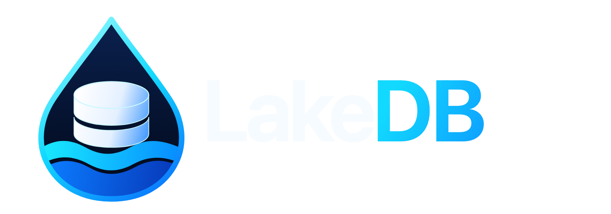
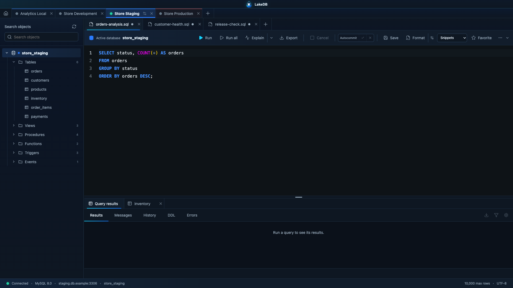
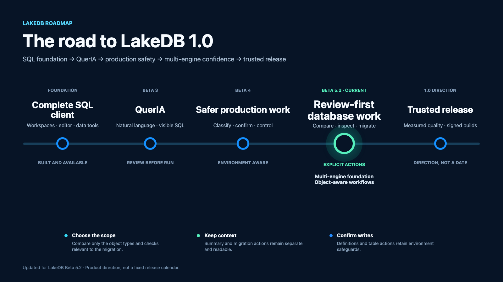

<p align="center">
  
</p>

<p align="center">
  <strong>A local-first database client for people tired of switching tools, losing context between connections, and trusting black-box AI with SQL.</strong><br>
  MySQL, MariaDB and SQLite today, with more engines planned. Keep separate workspaces, review generated or corrected SQL before anything runs, and stay in control of every database operation.
</p>

<p align="center">
  <a href="https://github.com/DavLagoHern/LakeDB/releases/tag/v1.0.0-beta.5.3.1"></a>
  <a href="https://github.com/DavLagoHern/homebrew-lakedb"></a>
  <a href="https://davlagohern.github.io/LakeDB/"></a>
</p>

<p align="center">
  
</p>

<p align="center"><sub><strong>One client, separate workspaces.</strong> Keep SQL, QuerIA, table tabs and connection context isolated instead of mixing everything into one editor state.</sub></p>

## Why LakeDB

- **One workspace across multiple engines** — work with MySQL, MariaDB and SQLite without changing tools.
- **Review-first AI** — QuerIA can generate SQL and help explain or correct query errors, but nothing runs automatically.
- **Production-aware workflows** — read-only connections, environment-specific confirmations and reviewable database operations.
- **Local-first by default** — credentials stay local, and database rows or query results are not sent to the AI service.

> 💡 **Help shape LakeDB:** suggest features, describe real database workflows and
> react to and discuss community ideas in [GitHub Discussions](https://github.com/DavLagoHern/LakeDB/discussions/categories/ideas).

<p align="center">
  <sub>LakeDB is free to use, but it is not open source. This public repository hosts official builds, documentation, issue tracking and community feedback.</sub>
</p>

<p align="center">
  <!-- 100 maintainer-recorded downloads from archived releases + live GitHub release asset downloads. -->
  <a href="https://github.com/DavLagoHern/LakeDB/releases"></a>
</p>

<p align="center">
  
  
  
  
  
      <a href="https://ecohub.mariadb.org/database-management/lakedb"></a>
</p>

---

## Install LakeDB

### macOS Apple Silicon — Homebrew

```bash
brew tap DavLagoHern/lakedb
brew trust DavLagoHern/lakedb
brew install --cask lakedb
```

The LakeDB tap checks the latest verified release every six hours and keeps the
Cask version and SHA-256 current automatically.

### Direct downloads

<p align="center">
  <a href="https://github.com/DavLagoHern/LakeDB/releases/download/v1.0.0-beta.5.3.1/LakeDB-1.0.0-beta.5.3.1-mac-arm64.dmg"></a>
  <a href="https://github.com/DavLagoHern/LakeDB/releases/download/v1.0.0-beta.5.3.1/LakeDB-1.0.0-beta.5.3.1-win-x64-setup.exe"></a>
  <a href="https://github.com/DavLagoHern/LakeDB/releases/download/v1.0.0-beta.5.3.1/LakeDB-1.0.0-beta.5.3.1-linux-x86_64.AppImage"></a>
</p>

| Platform | Alternative package | Install |
| --- | --- | --- |
| macOS Apple Silicon | [ZIP](https://github.com/DavLagoHern/LakeDB/releases/download/v1.0.0-beta.5.3.1/LakeDB-1.0.0-beta.5.3.1-mac-arm64.zip) | Move `LakeDB.app` to Applications. |
| Windows x64 | [Portable EXE](https://github.com/DavLagoHern/LakeDB/releases/download/v1.0.0-beta.5.3.1/LakeDB-1.0.0-beta.5.3.1-win-x64-portable.exe) | Run without installation. |
| Linux x64 | [Debian package](https://github.com/DavLagoHern/LakeDB/releases/download/v1.0.0-beta.5.3.1/LakeDB-1.0.0-beta.5.3.1-linux-amd64.deb) | Install with your package manager. |

> **Public beta signing:** macOS packages have an ad-hoc signature but are not
> notarized yet; Windows packages are not yet signed with a trusted
> certificate. Download only from the official LakeDB repositories. Every
> package has a matching SHA-256 file on the
> [Beta 5.3.1 release page](https://github.com/DavLagoHern/LakeDB/releases/tag/v1.0.0-beta.5.3.1).

---

## Latest release

LakeDB is currently available as **Beta 5.3.1**. See its changes and the full
version history in [GitHub Releases](https://github.com/DavLagoHern/LakeDB/releases).

---

## A complete SQL client

AI joins the existing LakeDB workflow; it does not replace it.

| Area | Available now |
| --- | --- |
| **Connections** | Multiple simultaneous MySQL, MariaDB and SQLite connections, folders, colors, read-only mode, diagnostics and search from Home or the connection picker. SSH and TLS remain server-engine capabilities. |
| **Workspaces** | Independent SQL, QuerIA and table tabs per connection, with restored editor content, selected schema and layout. |
| **SQL editor** | Monaco Editor, proactive schema completion, aliases, columns, PK/index hints, local syntax diagnostics, safe quick fixes, optional AI correction, formatting, Explain, transactions, history and streaming exports. |
| **QuerIA** | Reusable per-connection business contexts, Normal and Agentic generation, cross-database relationships, index inspection, `EXPLAIN` review, visible SQL and explicit local execution. |
| **Results and data** | Local query-result filters, draggable result columns, virtualized table grids, pagination, search, sorting and typed safe editing with conflict checks and rollback. |
| **Database tools** | MySQL/MariaDB backup and restore; selectable comparison for tables, views, procedures, functions, triggers and events; reviewable table migration plans and single-table copy. Capability-aware controls stay disabled when an engine does not support them. |
| **Safety** | Local encrypted credentials, production confirmations, renderer sandboxing, read-only enforcement and no remote database execution. |
| **Resilience** | Stable device identity, crash recovery, session restore, verified updates, configuration backup and diagnostics. |

---

## Where LakeDB differs

Shared capabilities such as merely opening multiple connections, SSH/SSL,
normal autocomplete and editable grids are intentionally omitted. LakeDB's
two-level connection workspace is included because every top-level connection
keeps its own nested SQL, QuerIA and object tabs instead of sharing one editor
context.

**✓ Included · ◐ Limited, paid or a different workflow · × No comparable built-in workflow · — No built-in AI / not applicable**

| Focused capability | LakeDB | DBeaver | TablePlus | MySQL Workbench | HeidiSQL |
| --- | :---: | :---: | :---: | :---: | :---: |
| Local syntax diagnostics before execution | ✓ | ✓ | × | ◐ | × |
| Explicit AI error correction with complete SQL review | ✓ | ◐ | ◐ | — | — |
| Top-level connection tabs with isolated, restored inner workspaces | ✓ | ◐ | ✓ | ✓ | ◐ |
| PK and index-aware completion predicates | ✓ | ◐ | × | × | × |
| Typed staged edits with conflict checks and rollback | ✓ | ◐ | ◐ | ◐ | ◐ |
| Guided restore with automatic recovery dump | ✓ | ◐ | ◐ | ◐ | ◐ |
| Schema compare and generated migration plan | ✓ | ◐ | × | ✓ | × |
| Dedicated line-based natural-language documents | ✓ | × | × | — | — |
| Agentic cross-database relationship discovery | ✓ | ◐ | × | — | — |
| Mandatory local SQL review before execution | ✓ | ◐ | ◐ | — | — |
| AI never receives row data or query results | ✓ | ◐ | ✓ | — | — |
| No retained questions, generated SQL or schema names | ✓ | × | ◐ | — | — |

A partial mark includes paid editions, plug-ins or a materially different
workflow. Sources: [DBeaver documentation](https://dbeaver.com/docs/dbeaver/Separate-Connections/),
[TablePlus documentation](https://docs.tableplus.com/gui-tools/the-interface/multi-tabs-workspaces-windows),
[MySQL Workbench manual](https://dev.mysql.com/doc/workbench/en/wb-configuring-files.html) and
[HeidiSQL documentation](https://www.heidisql.com/).

---

## Road to 1.0

| Stage | Direction |
| --- | --- |
| **SQL foundation** | Independent workspaces, schema-aware editing, safe data operations, database tools and recovery. |
| **Beta 3** | Natural-language query documents, visible SQL and explicit local execution. |
| **Beta 4 — complete** | Reusable connection context, Normal and Agentic generation, cross-database relationships, index inspection, reversible opt-in and clearer execution feedback. |
| **Beta 5.3 — current** | Local learned SQL formatting, clearer script failures and practical table workflow preferences. |
| **1.0 direction** | Measured quality, trusted signing and distribution, compatibility validation and complete product polish. |

<p align="center">
  <a href="docs/ROADMAP.md"></a>
</p>

Roadmap items describe direction, not a fixed release date. See
[ROADMAP.md](docs/ROADMAP.md) for the complete quality and trust gates.

---

## Support development

LakeDB's complete local SQL client is free to use. An optional
[Patreon membership](https://www.patreon.com/LakeDB/membership) helps fund its
continued development and includes higher QuerIA AI usage limits. Core local
database features are not locked behind a membership.

<p align="center">
  <a href="https://www.patreon.com/LakeDB/membership"></a>
</p>

---

## Community & support

<p align="center">
  <a href="https://github.com/DavLagoHern/LakeDB/discussions/categories/ideas"></a>
  <a href="https://github.com/DavLagoHern/LakeDB/issues/new?template=bug-report.yml"></a>
  <a href="https://www.reddit.com/r/LakeDB/"></a>
  <a href="https://www.patreon.com/LakeDB/membership"></a>
</p>

<p align="center">
  <a href="LICENSE"></a>
  <a href=".github/SECURITY.md"></a>
</p>

## Help shape LakeDB

- Read the [Wiki](https://github.com/DavLagoHern/LakeDB/wiki).
- Join the community on [Reddit](https://www.reddit.com/r/LakeDB/).
- Report reproducible bugs with the [bug report form](https://github.com/DavLagoHern/LakeDB/issues/new?template=bug-report.yml).
- Propose ideas in [GitHub Discussions](https://github.com/DavLagoHern/LakeDB/discussions).
- Support continued development or follow public updates on [Patreon](https://www.patreon.com/LakeDB/membership).

Testing, reporting and sharing LakeDB remain valuable ways to help this beta,
whether or not you become a paid member.

---

<p align="center">
  <br>
  <strong>SQL when you want it. Natural language when you need it.</strong>
</p>
