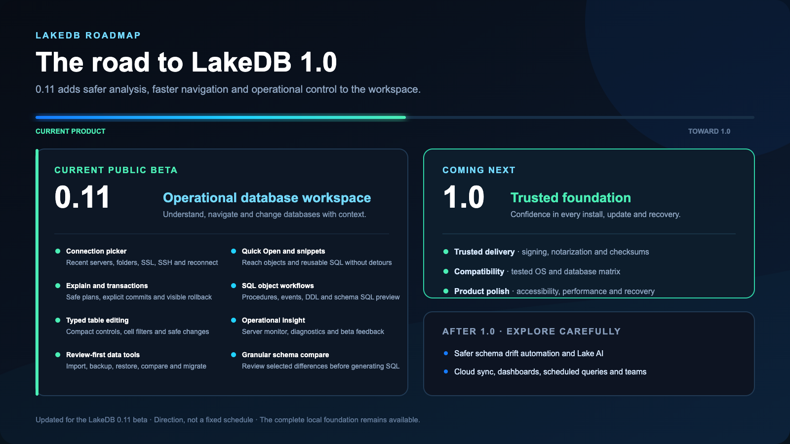

# LakeDB roadmap

The roadmap tracks complete product milestones, not individual patches. Smaller `ADD`, `CHANGE`, `FIX` and `SECURITY` entries live in the [version history](VERSION-HISTORY.md).

## Shipped milestones

| Line               | Product step                | What it established                                                                                                                                                                 |
| ------------------ | --------------------------- | ----------------------------------------------------------------------------------------------------------------------------------------------------------------------------------- |
| **0.1**            | Foundation                  | A focused local MySQL/MariaDB desktop application with connection, explorer and SQL foundations.                                                                                    |
| **0.2**            | Connections                 | Multiple simultaneous connections, folders, environments, SSL/SSH and independent workspaces.                                                                                       |
| **0.3**            | SQL workspace               | SQL tabs, object exploration, history, favorites and result navigation.                                                                                                             |
| **0.4**            | Safe data                   | Editing, filtering, paging, read-only mode, production safeguards and data exchange.                                                                                                |
| **0.5**            | Database tools              | Diagnostics, configuration backup, SQL backup/restore, schema comparison and table copy.                                                                                            |
| **0.6**            | Cross-platform              | macOS, Windows and Linux packages, English/Spanish UI and published checksums.                                                                                                      |
| **0.7**            | Resilience                  | Update discovery, guarded restores, session/crash recovery, migration snapshots and accessibility checks.                                                                           |
| **0.8**            | Editing polish              | Structured large-value editing, visible pending changes, explicit folders, verified updates and a Home-first lifecycle.                                                             |
| **0.9**            | Migration and large exports | Migration Studio, clearer active-connection context and configurable streaming exports up to 50 million rows.                                                                       |
| **0.10**           | Smarter daily workflow      | Split query/table panes, schema-aware completion, aliases and index guidance, visual schema design, typed editing, compact multitab navigation and review-first connection imports. |
| **0.11 — current** | Operational public beta     | Explain plans, visual transactions, Quick Open, persistent snippets, SQL-first object editing, granular schema comparison, session monitoring and in-app beta feedback.            |

## Current position

LakeDB 0.11.3 Beta 2 is the current public beta candidate. The complete current
capability set is documented in the [README](README.md); patch-by-patch detail
is kept out of this roadmap.

## Before 1.0

LakeDB 1.0 is a trust milestone focused on making the current product dependable, documented and upgrade-safe.

### Trusted distribution

- Obtain and configure Apple Developer ID and Windows code-signing identities.
- Integrate macOS signing/notarization and Windows signing into the official local publisher, which currently blocks stable tags.
- Verify signatures and clean-machine installation before publishing.
- Keep checksums, release notes and a documented verification path for every package.

### Stability and compatibility

- Publish an operating-system and MySQL/MariaDB compatibility matrix backed by real tests.
- Run packaged application smoke tests on Windows and Linux as well as macOS.
- Verify clean installation and upgrades from the retained 0.9 and 0.10 lines, including settings, credentials, sessions and recovery snapshots.
- Complete a release-candidate soak with no open data-loss, credential, restore, update or destructive-query blockers.

### Product polish

- Complete keyboard, focus and screen-reader review across critical workflows, not only the application shell.
- Define and verify performance budgets for large object trees, grids, exports and long SQL sessions.
- Finish first-run, troubleshooting, known-limit and recovery documentation.
- Complete the final security review of credentials, updates, imports, IPC boundaries and destructive operations.

### Public release readiness

- Publish clear licence/usage terms and a concise privacy statement.
- Define supported-version, bug-reporting and security-reporting expectations.
- Freeze 1.0 scope so the release candidate receives fixes rather than new workflow changes.

## Help define 1.0

Share real workflows and vote in [Discussions](https://github.com/DavLagoHern/LakeDB/discussions/categories/ideas). Community value, data safety and maintenance cost determine what ships.
