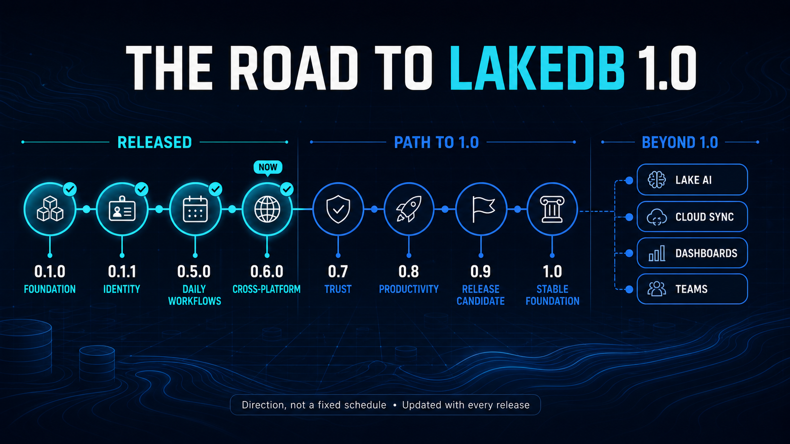

# The road to LakeDB 1.0

LakeDB is being built in public milestones. This page records what shipped, explains the direction toward a stable 1.0 release and keeps longer-term ideas visible without pretending they are fixed commitments.

## Released

| Version | Milestone | What changed |
| --- | --- | --- |
| **0.1.0** | Foundation | LakeDB became its own product with the first public release workflow and a focused MySQL/MariaDB desktop foundation. |
| **0.1.1** | Identity | The LakeDB name, droplet/database visual identity, application icon and product documentation were unified. |
| **0.5.0** | Daily workflows | Diagnostics, configuration backup, database backup/restore, schema comparison, table copy and a stronger connection experience made LakeDB useful for everyday work. |
| **0.6.0 — current** | Cross-platform | Native macOS, Windows and Linux packages, English/Spanish i18n, an international Wiki and community, real screenshots and verified release checksums. |

Download the current build from [Releases](https://github.com/DavLagoHern/LakeDB/releases/latest). Previous milestones remain documented here even though only the latest build is recommended.

## Proposed path to 1.0

These milestones describe direction rather than a fixed schedule. Their contents can move as real usage, bug reports and community votes teach us more.

### 0.7 — Trust

- Work toward signed/notarized packages and a smoother first-install experience.
- Improve update discovery, recovery and troubleshooting.
- Continue reliability, startup and connection lifecycle work.
- Make first-run onboarding clearer without adding a mandatory account.

### 0.8 — Productivity

- Faster keyboard-driven navigation and command discovery.
- Better reusable SQL/snippet organization.
- Deeper schema comparison and safer migration previews.
- Refined import, export and large-result workflows.

### 0.9 — Release candidate

- Compatibility and upgrade testing across supported operating systems.
- Performance, accessibility and visual consistency passes.
- Stable settings and workspace migrations.
- A public feedback and bug-fixing cycle focused on release blockers.

### 1.0 — Stable foundation

- A dependable LakeDB Free baseline for daily MySQL and MariaDB work.
- Stable installation, upgrades, local data and workspace behavior.
- Mature safety defaults for development, staging and production.
- Complete user documentation and a clear compatibility policy.

## Beyond 1.0: Pro exploration

LakeDB will remain one application and one download. Free keeps the local database foundation; an optional Pro subscription may add automation, intelligence, synchronization and collaboration.

- **Lake AI:** generate, explain, review and optimize SQL.
- **Lake AI Agent:** schema-aware analysis, index suggestions, documentation and assisted migrations.
- **Cloud sync:** synchronize favorites, snippets, workspaces and preferences.
- **Dashboards:** SQL widgets, charts, KPIs and scheduled queries.
- **Teams:** share workspaces, connection definitions without credentials, favorites and dashboards.

These are exploration areas, not announced release dates or guaranteed scope. Read [LakeDB Free and Pro](https://github.com/DavLagoHern/LakeDB/wiki/LakeDB-Free-and-Pro) for the product model.

## Help choose the route

Propose an idea, share a real workflow and vote in [Discussions](https://github.com/DavLagoHern/LakeDB/discussions/categories/ideas). Community interest helps set priority, while safety, maintenance cost and fit with LakeDB's product principles determine what ships.
