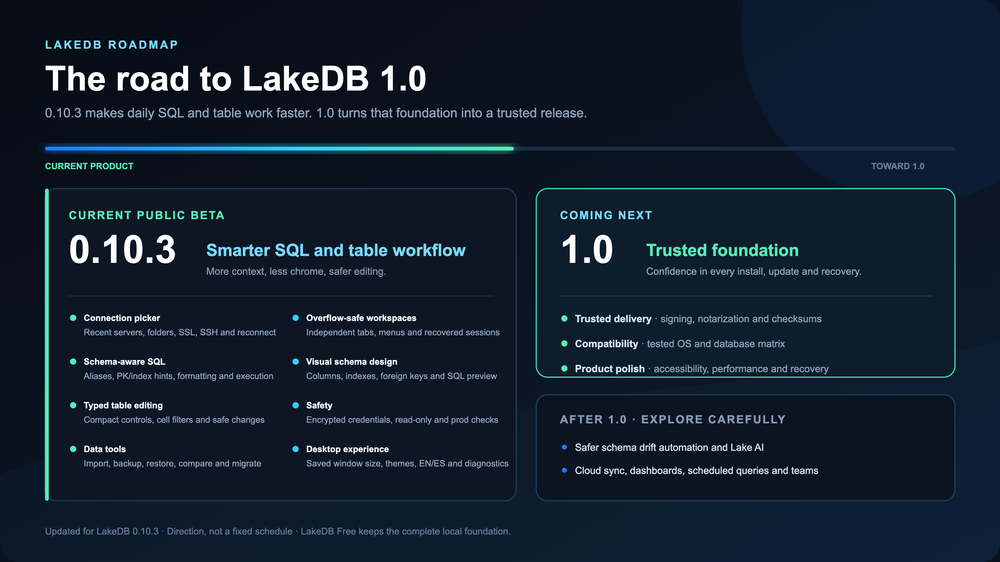

# LakeDB Roadmap

LakeDB is close to its 1.0 foundation. The roadmap now focuses on three things: what the current beta already gives you, what must be true for 1.0, and which ideas belong after the stable foundation.

The [latest release](https://github.com/DavLagoHern/LakeDB/releases/latest) is always the recommended build. Future scope is directional and shaped by real workflows, safety, maintenance cost and community feedback.

## Current beta: 0.10.4

LakeDB 0.10.4 is the latest build in the current 0.10 public beta line:

- Saved connections, folders, environment colors, SSL, SSH tunnels and automatic reconnect.
- Review-first DBeaver, SQLyog, JSON, CSV and SQL URL imports with row selection, editable names/users, credential overrides and explicit duplicate handling.
- A virtual **Unclassified** Home group for every connection without a saved folder.
- Independent workspaces per connection, with SQL tabs above and query-result/table tabs in a live-resizable lower pane.
- Monaco SQL editing with schema-aware completion, automatic aliases, PK/index hints and multi-column index predicate templates.
- Compact and expanded SQL formatting with a remembered preference.
- A lazy object explorer where one click opens table data and a deliberate double-click inserts the table name into SQL.
- A virtualized table grid with typed editors, cell-driven filtering, pagination, sorting, search, exports and safe buffered changes.
- Compact two-row table controls that leave more vertical space for data.
- Overflow navigation and an all-tabs menu for large connection, query and table workspaces.
- A compact connection picker with recent connections and folders.
- Empty `SELECT` results remain useful grids with their column headers.
- Configurable streaming exports to CSV, JSON, JSON Lines, Excel-compatible and SQL formats, optionally compressed with GZIP.
- Backup, restore, database comparison and selectable multi-table migration plans.
- Local encrypted credentials, read-only mode, production confirmations, renderer sandboxing and diagnostics.
- English/Spanish UI, appearance preferences, update notices and configuration recovery.

## What remains for 1.0

LakeDB 1.0 is a trust milestone focused on distribution confidence, compatibility and upgrade safety.

### Trusted distribution

- Code signing for supported desktop platforms.
- macOS notarization.
- Clear publisher identity and fewer first-install security warnings.
- Published checksums and release notes for every package.

### Stability and compatibility

- Documented operating system and MySQL/MariaDB compatibility matrix.
- Broader release-candidate testing across macOS, Windows and Linux.
- Stable local settings, credential and session migrations between releases.
- Clear recovery guidance for restore, update and crash scenarios.

### Product polish

- Accessibility and keyboard navigation pass across the complete workspace.
- Performance pass for large object trees, large grids and long SQL sessions.
- Cleaner first-run and troubleshooting guidance.
- Final review of destructive-operation confirmations.

## Help define LakeDB

Propose an idea, share a real workflow and vote in [Discussions](https://github.com/DavLagoHern/LakeDB/discussions/categories/ideas). Community interest helps set priority, while safety and maintenance cost determine what ships.

Small changes between builds are kept in the [version history](VERSION-HISTORY.md).
