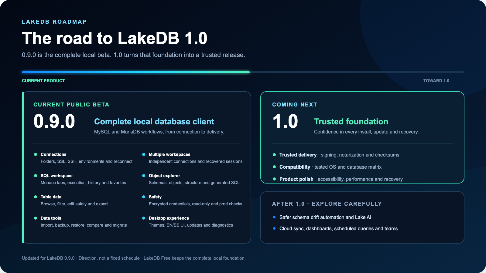

# LakeDB Roadmap

LakeDB is close to its 1.0 foundation. The roadmap now focuses on three things: what the current beta already gives you, what must be true for 1.0, and which ideas belong after the stable foundation.

The [latest release](https://github.com/DavLagoHern/LakeDB/releases/latest) is always the recommended build. Future scope is directional and shaped by real workflows, safety, maintenance cost and community feedback.

## Current beta: 0.9.0

LakeDB 0.9.0 is the current public beta of the local MySQL/MariaDB desktop app. It includes the complete day-to-day foundation:

- Saved connections, folders, environment colors, SSL, SSH tunnels and automatic reconnect.
- Independent workspaces per connection, with SQL tabs, table tabs, selected databases and session recovery.
- Monaco SQL editing, statement/selection execution, cancellation, history, favorites and exports.
- Lazy object explorer for databases, tables, views, routines, triggers, events, DDL and generated SQL.
- Virtualized table grid with pagination, filtering, sorting, search, exports and safe row editing.
- Backup, restore, database comparison and selectable multi-table migration plans.
- Local encrypted credentials, read-only mode, production confirmations, renderer sandboxing and diagnostics.
- English/Spanish UI, appearance preferences, update notices and configuration recovery.

## What remains for 1.0

LakeDB 1.0 is a trust milestone. Free remains the complete local database client foundation; 1.0 is about distribution confidence, compatibility and upgrade safety.

### Trusted distribution

- Code signing for supported desktop platforms.
- macOS notarization.
- Clear publisher identity and fewer first-install security warnings.
- Published checksums and release notes for every package.

### Stability and compatibility

- Documented operating system and MySQL/MariaDB compatibility matrix.
- Broader release-candidate testing across macOS, Windows and Linux.
- Stable local settings, credential and session migrations between releases.
- Clear recovery guidance for restore, update and crash scenarios.

### Product polish

- Accessibility and keyboard navigation pass across the complete workspace.
- Performance pass for large object trees, large grids and long SQL sessions.
- Cleaner first-run and troubleshooting guidance.
- Final review of destructive-operation confirmations.

## After 1.0

These are exploration areas, not announced release dates or guaranteed scope.

- **Safer schema drift automation:** reviewed DDL suggestions for existing tables before automated structure changes.
- **Lake AI:** generate, explain, review and optimize SQL.
- **Lake AI Agent:** schema-aware analysis, index suggestions, documentation and assisted migrations.
- **Cloud sync:** synchronize favorites, snippets, workspaces and preferences.
- **Dashboards:** SQL widgets, charts, KPIs and scheduled queries.
- **Teams:** share workspaces, connection definitions without credentials, favorites and dashboards.

## Help define LakeDB

Propose an idea, share a real workflow and vote in [Discussions](https://github.com/DavLagoHern/LakeDB/discussions/categories/ideas). Community interest helps set priority, while safety, maintenance cost and fit with LakeDB's product principles determine what ships.
