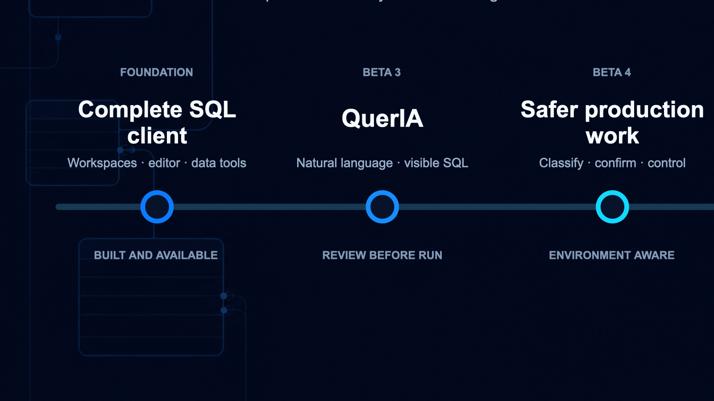

# LakeDB roadmap

LakeDB Beta 6.0 adds PostgreSQL as a native engine across connections,
metadata, safe editing, exports, database tools and QuerIA. The roadmap tracks
complete product stages rather than every patch.

## Current: Beta 6.0

PostgreSQL connections use their own runtime, dialect, quoting, catalog and
type handling. LakeDB understands databases, schemas and `search_path`, and can
browse tables, views, materialized views, functions, procedures, sequences and
types.

PostgreSQL rows are editable only with a stable identity and optimistic
conflict detection. Complete-query exports, table design, schema backup and
restore, comparison, transactional table copy, operations, roles, QuerIA and
AI correction all use PostgreSQL-specific behavior and explicit review.

The validated beta baseline is PostgreSQL 18. PostgreSQL 14–17, managed
services, restricted roles and large schemas remain priority compatibility
feedback areas before 1.0.

## Released: Beta 5.4

MySQL and MariaDB gained visual relationship maps, grouped system schemas and
reviewable account and privilege management. Real foreign keys stay visually
distinct from LakeDB-only local links.

## Released: Beta 5.3

LakeDB can learn a saved formatting profile from separate `SELECT`, `INSERT`,
`UPDATE` and `DELETE` examples using local, deterministic analysis. Script
errors identify the exact failed statement while retaining completed results;
export folders, table widths, searches and locally hidden tables are remembered.

## Released: Beta 5.1

SQLite connections can browse tables, views and triggers, run cancellable SQL
with explicit transactions, edit rows with stable identities, inspect
`EXPLAIN QUERY PLAN` and use dialect-aware diagnostics and reviewable AI help.
Engine manifests keep unsupported operations disabled: SQLite does not claim
SSH/TLS, server monitoring, database dump/restore, schema comparison or table
copy.

MySQL and MariaDB retain their SSH, TLS, diagnostics, monitoring and transfer
workflows. Internal settings upgrades now validate the migration ledger and
physical schema, create an immutable pre-upgrade backup and roll back failed
upgrades. LakeDB protects its live internal SQLite database from being opened
as a user connection; tests should use a copy or backup.

## Completed: Beta 4.5

QuerIA now offers two ways to prepare reviewable SQL:

- **Normal** for direct questions and known tables.
- **Agentic** for workflows that benefit from broader catalog discovery,
  structure inspection, cross-database relationships, keys, indexes and
  `EXPLAIN` review.

Agentic generation is bounded by configurable context limits. It reports the
tables used and the relevant plan signals, then returns visible SQL. It cannot
execute a query by itself.

Beta 4 also adds connection search, language-aware explanations, stable device
identity, table links inside QuerIA results, clearer service states, Beta
Tester applications and direct issue reporting. Beta 4.4 adds reusable
business contexts with local defaults and connection-specific selection so
QuerIA can interpret database roles and relationships beyond table names.
Beta 4.5 adds environment-aware confirmation levels, safer Production
defaults, bulk connection editing and lower-cost on-demand server monitoring.

## Product stages

| Stage | Direction |
| --- | --- |
| **SQL foundation** | Multiple workspaces, schema-aware editing, safe table operations, Explain, transactions, backup, compare, migrate and recovery. |
| **Beta 3** | QuerIA natural-language documents, schema-grounded SQL, visible review, explicit local execution and privacy opt-in. |
| **Beta 4 — complete** | Reusable business context, Normal and Agentic generation, cross-database relationships, table and index inspection, plan review and community testing. |
| **Beta 5 — complete** | SQLite beside MySQL/MariaDB, review-first database tools, local learned formatting, visible relationships and access management. |
| **Beta 6 — current** | Native PostgreSQL connections, catalog browsing, safe editing, design, exports, operations, transfer paths and review-first AI. |
| **1.0 — direction** | Measured AI quality, trusted distribution, compatibility validation, accessibility and complete product polish. |

Future stages describe direction, not a fixed date or guaranteed scope.
Feedback, privacy and safety findings can change their order.

## Permanent control gates

QuerIA must preserve these boundaries:

- no LakeDB Service request before explicit activation;
- disabling QuerIA stops service requests and reactivation requires renewed
  consent;
- no database credentials, rows or query results sent to the service;
- no retained questions, selected business context, generated SQL, schema
  metadata or table names;
- visible SQL before every execution;
- user-selected context that cannot override schema or safety boundaries;
- bounded schema investigation;
- the complete local client remains available when QuerIA is disabled,
  unavailable or has no remaining allowance.

## Before 1.0

### AI quality

- Maintain a repeatable evaluation set for direct and agentic workflows.
- Measure table selection, relationship, syntax, safety and plan quality.
- Cover complex joins, dates, indexes, placeholders, writes and DDL.
- Show useful failure states when a safe statement cannot be prepared.

### Trusted distribution

- Apple Developer ID signing and notarization for macOS.
- Trusted Windows code signing.
- Clean-machine installation and upgrade validation.
- Checksums and a documented verification path for every package.

### Stability and compatibility

- Test supported macOS, Windows and Linux versions.
- Test representative MySQL and MariaDB versions.
- Expand PostgreSQL validation beyond the PostgreSQL 18 beta baseline to
  versions 14–17 and representative managed services.
- Run packaged smoke tests and retained-beta upgrade tests.
- Complete a release-candidate soak with no data-loss, credential, update,
  restore or destructive-query blockers.

### Product and documentation

- Complete keyboard, focus and screen-reader review.
- Keep first-run, privacy, known-limit, recovery and troubleshooting guides
  current.
- Expand Beta Tester feedback against real multi-database workflows.
- Freeze the 1.0 scope during release-candidate testing.

## Help define 1.0

Request Beta Tester access from **Settings → Account**, share workflows in
[Discussions](https://github.com/DavLagoHern/LakeDB/discussions/categories/ideas)
or send reproducible bugs through the
[issue form](https://github.com/DavLagoHern/LakeDB/issues/new?template=bug-report.yml).
